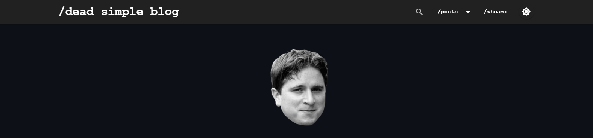

# dead-simple-blog

[](#)
[](#)
[](#)
[](https://twitter.com/Ooggule)

dead-simple blog template powered by Markdown and PHP

## ✨ Features

- Simple and lightweight blog engine
- Markdown support for writing posts
- Multi-language support
- Customizable themes (light/dark mode)
- SEO-friendly
- Mobile-responsive design
- Built-in statistics tracking
- Easy deployment with Docker

## 🚀 Quick Start

1. Clone the repository:
```sh
git clone https://github.com/Ooggle/dead-simple-blog.git
cd dead-simple-blog
```

2. Edit `docker-compose.yml` to set your environment variables.

3. Start the blog:
```sh
docker-compose up -d
```

Your blog is now running!

## ⚙️ Configuration

### 🔧 Main Configuration

Edit `website.conf.php` to customize your blog settings.

### 📚 Content Management

#### 🗺️ sitemap.json

The `sitemap.json` file is where you add and manage your articles. Here's how it works:

- You can add articles that point to either `.md`, `.html`, or `.php` files.
- The engine will automatically display the articles on the website.
- To hide an article from the list (but still make it accessible via URL), add `"hidden": true` to the article entry.
- Articles are not sorted by date, but by their order in the file. The article at the top will be displayed first.

Example structure:

```json
{
  "posts": [
    {
      "url": "my-first-post",
      "title": "My First Post",
      "date": "2023-04-15",
      "file": "articles/my-first-post.md"
    },
    {
      "url": "hidden-article",
      "title": "Hidden Article",
      "date": "2023-04-16",
      "file": "articles/hidden-article.html",
      "hidden": true
    }
  ]
}
```

The sample file in the repository provides examples of different possibilities for creating articles.

1. **📝 Adding Posts**: Add your articles to the `sitemap.json` file.

2. **🏷️ Organizing Content**: Use tags to categorize your posts.

3. **🌐 Multi-language Support**: Set up language-specific content in the `sitemap.json` file.

### 🎨 Customization

1. **🌓 Themes**: The blog supports both light and dark modes. Customize the colors in `website.conf.php`.

2. **📐 Layout**: Modify the templates in the `blog/assets/inc/` directory to change the layout and structure of your blog.

## 📊 Statistics

To enable and view statistics for your site:

1. Set `$config['enable_stats'] = true;` in `website.conf.php`.
2. Go to `/admin/setup` and enter your admin credentials (set in docker-compose.yml).
3. Access `/admin/` or `/admin/dashboard` to view your statistics.

## 🔄 Updating

Use the provided update script to keep your blog up-to-date:

```sh
wget https://raw.githubusercontent.com/Ooggle/dead-simple-blog/master/update.sh && chmod u+x ./update.sh
./update.sh path/to/your/apache2/src/
```

## 🤝 Contributing

Contributions are welcome! Please feel free to submit a Pull Request.